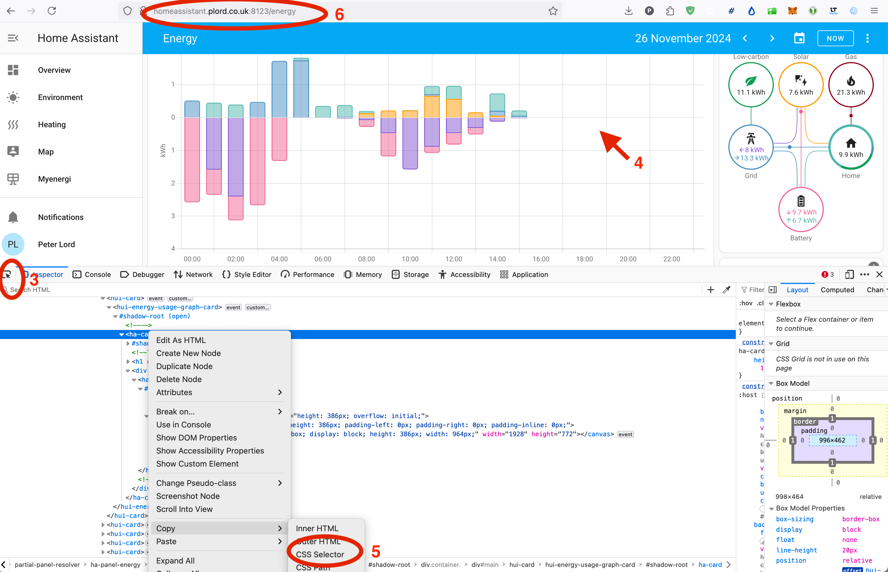

# Webscrapers
This contains a set of webscrapers I personally use.  

* [Aviva](#user-content-aviva)
* [Aviva My Workplace](#user-content-aviva-my-workplace)
* [Fund](#user-content-fund)
* [Home Assistant Screen Shot](#user-content-home-assistant-screen-shot)
* [Home Assistant Screen Shot Addon](#user-content-home-assistant-screen-shot-addon)
* [Moneyfarm](#user-content-moneyfarm)
* [Money Hub](#user-content-money-hub)
* [Nutmeg](#user-content-nutmeg)
* [Octopus Wheel](#user-content-octopus-wheel)
* [U3A Groups](#user-content-u3a-groups)
* [Desktop Testing](#user-content-desktop-testing)
* [Pension Scripting](#user-content-pension-scripting)

They make use of [playwright-go](https://github.com/playwright-community/playwright-go) so that a single binary only is needed - browser dependencies are auto downloaded if missing.

```
bin/fund -fund 0P0001JLD9
Downloading Chromium 129.0.6668.29 (playwright build v1134) from https://playwright.azureedge.net/builds/chromium/1134/chromium-mac-arm64.zip
139 MiB [====================] 100% 0.0s
Chromium 129.0.6668.29 (playwright build v1134) downloaded to /Users/plord/Library/Caches/ms-playwright/chromium-1134
Downloading FFMPEG playwright build v1010 from https://playwright.azureedge.net/builds/ffmpeg/1010/ffmpeg-mac-arm64.zip
1.1 MiB [====================] 100% 0.0s
FFMPEG playwright build v1010 downloaded to /Users/plord/Library/Caches/ms-playwright/ffmpeg-1010
2024/11/12 13:14:51 Starting fund
2024/11/12 13:14:54 value=11.95
11.95
```

## [Aviva](aviva)

Connect to [Aviva](https://www.direct.aviva.co.uk/MyAccount/login), login, process one-time-password and return account balance.

```
Usage:
  aviva [OPTIONS]

Application Options:
  -e, --headless         Headless mode [$HEADLESS]
  -u, --username=        Aviva username [$AVIVA_USERNAME]
  -p, --password=        Aviva password [$AVIVA_PASSWORD]
  -o, --otppath=         Path to file containing one time password message (default: otp/aviva) [$OTP_PATH]
  -c, --otpcommand=      Command to get one time password [$OTP_COMMAND]
  -l, --otpcleancommand= Command to clean previous one time password [$OTP_CLEANCOMMAND]
```

## [Aviva My Workplace](avivamyworkplace)

Connect to [Aviva My Workplace](https://zzz.myworkplace.aviva.co.uk), login and return account balance.

```
Usage:
  avivamyworkplace [OPTIONS]

Application Options:
  -e, --headless  Headless mode [$HEADLESS]
  -u, --username= Aviva my money username [$AVIVAMYWORKPLACE_USERNAME]
  -p, --password= Aviva my money password [$AVIVAMYWORKPLACE_PASSWORD]
```

## [Fund](fund)

Connect to [Financial Times](https://markets.ft.com) and return fund value.

```
Usage:
  fund [OPTIONS]

Application Options:
  -e, --headless  Headless mode [$HEADLESS]
  -f, --fund=     Fund name [$FUND]
```

## [Home Assistant Screen Shot](ha_ss)

Connect to local Home Assistant instance, login and take a screen shot based on CSS selector.

```
Usage:
  ha_ss [OPTIONS]

Application Options:
  -e, --headless  Headless mode [$HEADLESS]
  -u, --username= Home assistant username [$HA_USERNAME]
  -p, --password= Home assistant password [$HA_PASSWORD]
  -r, --restport= If set, startup REST server at given port [$HA_RESTPORT]
  -l, --url=      Home assistant page URL [$HA_URL]
  -c, --css=      Home assistant CSS selector [$HA_CSS]
  -a, --path=     Output screenshot path (default: output.png) [$HA_PATH]
```

### Find CCS selector

ha_ss requires a URL and CSS selector.  To determine these -

1. use your browser to navigate to the home assistant page
2. start development tools -
  * Firefox use Tools -> Browser Tools -> Web Development Tools
  * Chrome use View -> Developer -> Developer Tools
3. Select pick an element (arrow on toolbar)
4. Click on the area you want to screenshot
5. Use the pop-up menu Copy -> CSS selector
6. Note the page URL



## [Home Assistant Screen Shot Addon](ha_ss_addon)

Simple Home Assistant addon that hosts ha_ss as a REST server.  This enables automations to include charges with notifications
such as :

```
alias: Car - next green time to charge
description: ""
triggers:
  - entity_id:
      - binary_sensor.octopus_energy_a_xxxxxxx_greenness_forecast_highlighted
    attribute: next_start
    trigger: state
conditions: []
actions:
  - action: rest_command.screenshot
    data:
      url: http://homeassistant.local:8123/lovelace/overview
      css: >-
        div.card:nth-child(4) > hui-card:nth-child(1) >
        octopus-energy-greenness-forecast-card:nth-child(1)
      filename: greenness-forecast.png
  - action: notify.gaselectricity
    data:
      message: >-
        Next octopus greenness forcast is {{
        state_attr('binary_sensor.octopus_energy_a_xxxxxxx_greenness_forecast_highlighted',
        'next_start')|as_local()|as_timestamp()|timestamp_custom('%a %b %-d,
        %I:%M %p') }} to {{
        state_attr('binary_sensor.octopus_energy_a_xxxxxxx_greenness_forecast_highlighted',
        'next_end')|as_local()|as_timestamp()|timestamp_custom('%a %b %-d, %I:%M
        %p') }} - see https://octopus.energy/smart/greener-days
      data:
        attachments:
          - /config/screenshots/greenness-forecast.png
mode: single
```

The steps to install this addon are (currently) :

1. Build ha_ss-linux binaries for linux with `make bin/ha_ss-linux-arm64 bin/ha_ss-linux-amd64`
2. Copy Dockerfile* *.yaml run.sh ha_ss-linux-* to the home assistant /addons/ha_ss_addon directory
3. Refresh addons on Home Assistant
4. In the Addon Store, select the local screenshot tool addon and install
5. In the new addon, build the image and start

configuration.yaml will need :

```
rest_command:
  screenshot:
    url: http://localhost:3500
    method: post
    headers:
      accept: "application/json, text/html"
    payload: '{"url": "{{ url }}", "css": "{{ css }}", "filename": "{{ filename }}"}'
    content_type:  'application/json; charset=utf-8'
    timeout: 120
```

(I'm pretty sure there is a better way to communicate between ha_ss automations)

## [Moneyfarm](moneyfarm)

Connect to [Moneyfarm](hhttps://app.moneyfarm.com/gb/sign-in), login, process one-time-password and return account balance.

```
Usage:
  moneyfarm [OPTIONS]

Application Options:
  -e, --headless         Headless mode [$HEADLESS]
  -u, --username=        Moneyfarm username [$MONEYFARM_USERNAME]
  -p, --password=        Moneyfarm password [$MONEYFARM_PASSWORD]
  -o, --otppath=         Path to file containing one time password message (default: otp/moneyfarm) [$OTP_PATH]
  -c, --otpcommand=      Command to get one time password [$OTP_COMMAND]
  -l, --otpcleancommand= Command to clean previous one time password [$OTP_CLEANCOMMAND]
```

## [Money Hub](moneyhub)

Connect to [Money Hub](https://client.moneyhub.co.uk), login and update the balance of one asset.

```
Usage:
  moneyhub [OPTIONS]

Application Options:
  -e, --headless  Headless mode [$HEADLESS]
  -u, --username= Moneyhub username [$MONEYHUB_USERNAME]
  -p, --password= Moneyhub password [$MONEYHUB_PASSWORD]
  -a, --account=  Moneyhub account(s) [$MONEYHUB_ACCOUNT]
  -b, --balance=  Moneyhub balance(s) [$MONEYHUB_BALANCE]
```

## [Nutmeg](nutmeg)

Connect to [Nutmeg](https://authentication.nutmeg.com/login), login, process one-time-password and return account balance.

```
Usage:
  nutmeg [OPTIONS]

Application Options:
  -e, --headless         Headless mode [$HEADLESS]
  -u, --username=        Nutmeg username [$NUTMEG_USERNAME]
  -p, --password=        Nutmeg password [$NUTMEG_PASSWORD]
  -o, --otppath=         Path to file containing one time password message (default: otp/nutmeg) [$OTP_PATH]
  -c, --otpcommand=      Command to get one time password [$OTP_COMMAND]
  -l, --otpcleancommand= Command to clean previous one time password [$OTP_CLEANCOMMAND]
```

## [Octopus Wheel](octopuswheel)

Connect to [Octopus Energy](https://octopus.energy/login/), login and spin wheel of furtune.

```
Usage:
  octopuswheel [OPTIONS]

Application Options:
  -e, --headless  Headless mode [$HEADLESS]
  -u, --username= Octopus username [$OCTOPUS_USERNAME]
  -p, --password= Octopus password [$OCTOPUS_PASSWORD]
```

## [U3A Groups](u3agroups)

Find U3A groups from https://u3asites.org.uk/oversights/groups/groupsearch.php and send a message to group co-ordinators

```
Usage:
  u3agroups [OPTIONS]

Application Options:
  -e, --headless  Headless mode [$HEADLESS]
  -s, --search=   Search term [$U3AGROUPS_SEARCH]
  -n, --name=     Message name [$U3AGROUPS_NAME]
  -m, --email=    Message email [$U3AGROUPS_EMAIL]
  -u, --subject=  Message subject [$U3AGROUPS_SUBJECT]
  -g, --message=  Message [$U3AGROUPS_MESSAGE]
  -d, --send      Send message [$U3AGROUPS_SEND]
```

# Desktop Testing

The Makefile contains some test rules which can be enabled by creating an `env` file.  Since this will contain usernames and passwords
my version is not checked in.

```
HEADLESS=false

HA_USERNAME=xxx
HA_PASSWORD=xxx

TEST1_HA_URL=http://homeassistant.local:8123/dashboard-screenshots/0
TEST1_HA_CSS=div.card:nth-child(2) > hui-card:nth-child(1) > plotly-graph:nth-child(1)

TEST2_HA_URL=http://homeassistant.local:8123/dashboard-screenshots/0
TEST2_HA_CSS=div.card:nth-child(6) > hui-card:nth-child(1) > plotly-graph:nth-child(1)

TEST3_HA_URL=http://homeassistant.local:8123/lovelace/overview
TEST3_HA_CSS=div.card:nth-child(5) > hui-card:nth-child(1) > plotly-graph:nth-child(1)

AVIVA_USERNAME=xxx
AVIVA_PASSWORD=xxx
AVIVA_OTPCLEANCOMMAND=ssh xxx rm src/webscrapers/otp/aviva
AVIVA_OTPCOMMAND=scp xxx:src/webscrapers/otp/aviva otp/aviva

AVIVAMYWORKPLACE_USERNAME=xxx
AVIVAMYWORKPLACE_PASSWORD=xxx

TEST1_NUTMEG_USERNAME=xxx
TEST1_NUTMEG_PASSWORD=xxx
TEST2_NUTMEG_USERNAME=xxx
TEST2_NUTMEG_PASSWORD=xxx
NUTMEG_OTPCLEANCOMMAND=ssh xxx rm src/webscrapers/otp/nutmeg
NUTMEG_OTPCOMMAND=scp xxx:src/webscrapers/otp/nutmeg otp/nutmeg

TEST1_FUND=0P0001JLD9
TEST2_FUND=0P0001JLD7

TEST1_MONEYFARM_USERNAME=xxx
TEST1_MONEYFARM_PASSWORD=xxx
TEST2_MONEYFARM_USERNAME=xxx
TEST2_MONEYFARM_PASSWORD=xxx
MONEYFARM_OTPCLEANCOMMAND=ssh xxx rm src/webscrapers/otp/moneyfarm
MONEYFARM_OTPCOMMAND=scp xxx:src/webscrapers/otp/moneyfarm otp/moneyfarm

TEST1_MONEYHUB_USERNAME=xxx
TEST1_MONEYHUB_PASSWORD=xxx
TEST1_MONEYHUB_ACCOUNT=My SIPP [ Manual ]

TEST1_OCTOPUS_USERNAME=xxx
TEST1_OCTOPUS_PASSWORD=xxx
```

# Pension scripting

I use these tools to download my pension values, update home assistant, write to google drive (to be picked up by a google spreadsheet) and
send a signal message with the summary.  You'll need to figure out a way to (safely) retrieve one time passwords. 